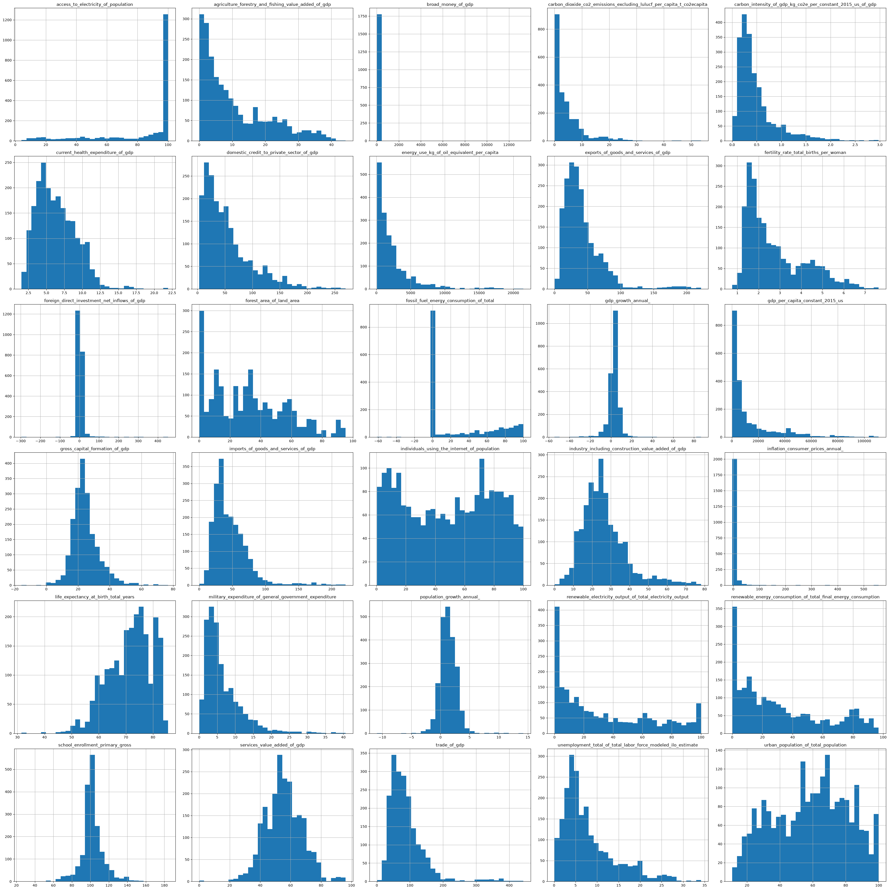
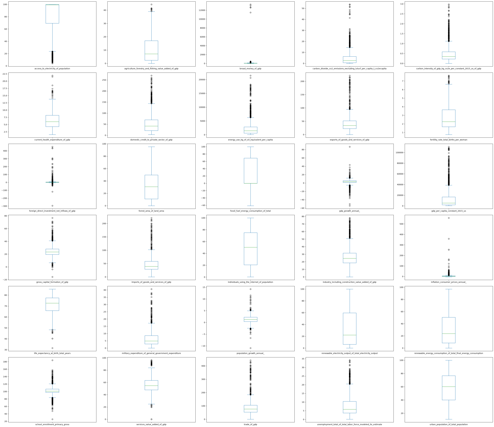
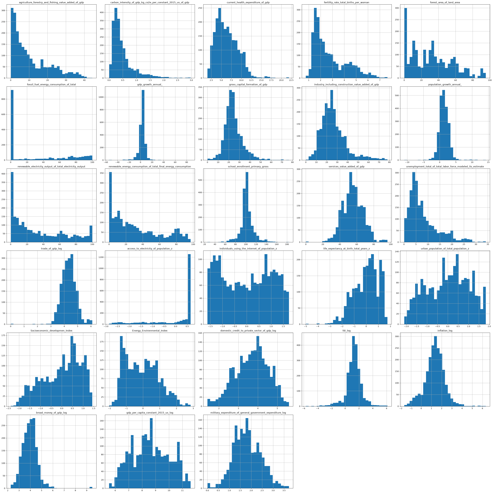
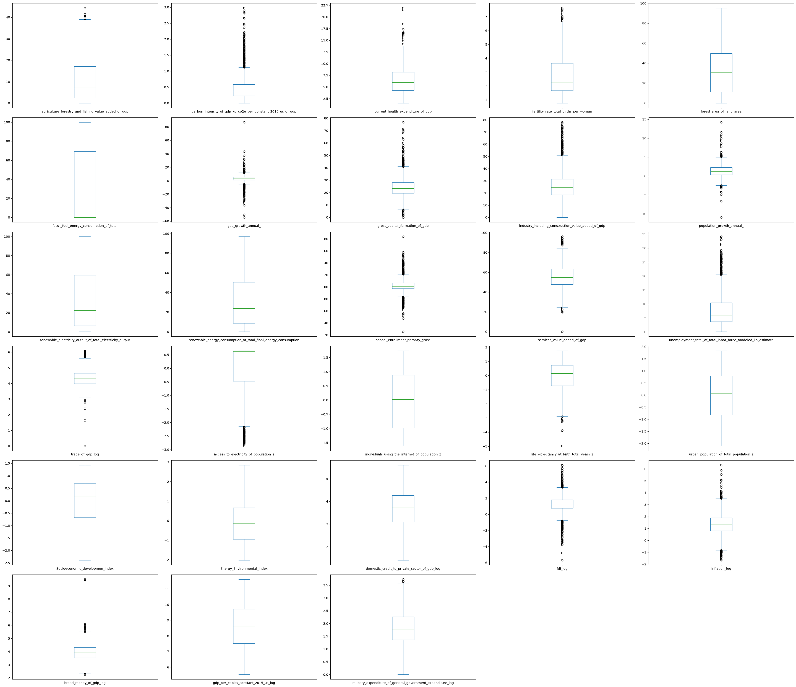
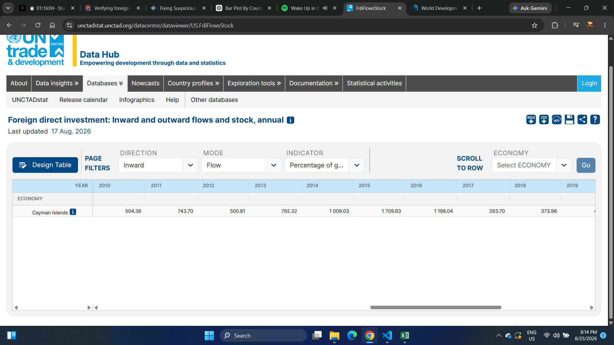
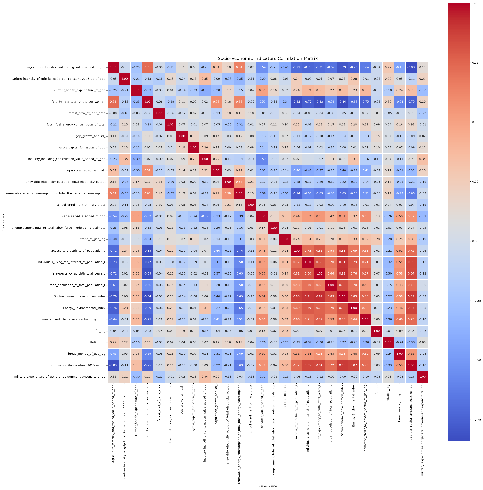
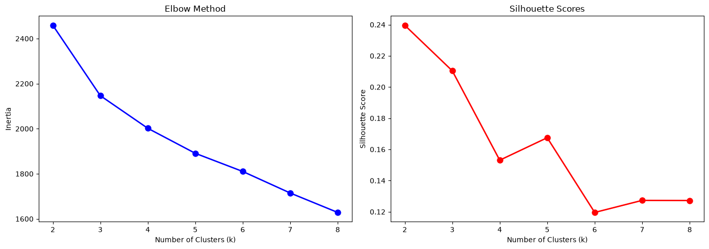
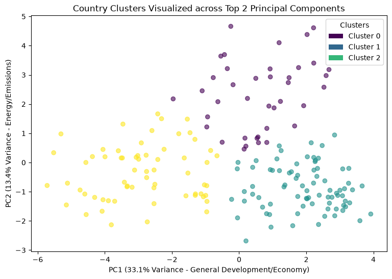

# Project Overview

This project builds an **unsupervised socioeconomic profile of 182 countries** using World Bank World Development Indicators (2010–2021).
Raw indicators are cleaned, transformed, and merged into composite indices, then reduced with **PCA** and grouped with **K-Means**. The trained pipeline is deployed in a **Streamlit app** that predicts the cluster of a new country profile and answers questions through a **RAG chatbot** (ChromaDB + Gemini).


## Objectives

* Clean and reshape raw World Bank data into a country-year panel.
* Handle missing values and outliers with documented, reproducible rules.
* Build composite indices to reduce redundancy between correlated indicators.
* Segment countries into clusters and validate them with quantitative metrics.
* Deploy the model with a RAG assistant that explains the results.


## Key Analyses

* **Null Analysis:** Missing values by country, indicator, and year → drop, interpolate, or impute.
* **Distribution Analysis:** Histograms and boxplots before/after log transformation.
* **Correlation Analysis:** Heatmap used to justify the composite indices.
* **Model Selection:** Elbow method and silhouette score for `k = 2…8`.
* **Dimensionality Reduction + Clustering:** PCA (2 components, **46.46%** variance) and K-Means with `k = 3` → *Silhouette = 0.492, Davies-Bouldin = 0.745, Calinski-Harabasz = 246.06*.


## Tools & Technologies

* **Data & ML:** `pandas`, `numpy`, `scikit-learn`, `pycountry`, `joblib`
* **Visualization:** `matplotlib`, `seaborn`
* **App & RAG:** `streamlit`, `langchain`, `ChromaDB`, `FastEmbed`, `Gemini`
* **Environment:** Jupyter Notebook / VS Code


## Key Findings

* The Socioeconomic Development Index correlates **0.89** with log GDP per capita and **−0.84** with fertility rate.
* Extreme values (FDI, inflation, broad money) are mostly real, so they were **transformed, not removed**.
* `k = 3` gives well-separated clusters (**Silhouette = 0.492** in PCA space).
* PC1 (33.1%) = general development/economy; PC2 (13.4%) = energy/emissions.


## Next Steps

* Cluster country *trajectories* over time instead of 12-year averages.
* Compare K-Means with Hierarchical clustering and GMM.
* Add a cluster map and country comparison to the app.


# Project Structure

```
├── app.py                  # Streamlit app (prediction form + RAG chat)
├── data/                   # raw WDI file + Processed_Data/Clustered_Data.xlsx
├── notebooks/              # 1_Data_Clean → 4_The_Model_&_Cluster_Analysis + .pkl models
├── docs/                   # all_rag_documents.json (RAG knowledge base)
├── src/                    # doc_generator, vectorstore, retriever
├── chroma_db/              # vector database
└── output/                 # charts used in this report
```


# Goal

1. **Segment countries by socioeconomic profile:** Group countries with similar development, economic, and energy characteristics.

2. **Build a reproducible ML pipeline:** From raw World Bank data to saved `scaler`, `pca`, and `kmeans` models.

3. **Make results accessible:** Let anyone enter a country's indicators, get its cluster, and ask questions in natural language.


# Questions

1. **Which indicators, countries, and years have the most missing data?**
2. **Which countries are the most open to trade?**
3. **Which indicators are skewed and need transformation?**
4. **Are the extreme FDI values errors or real observations?**
5. **Which indicators are correlated enough to merge into indices?**
6. **How were the remaining missing values filled?**
7. **What is the optimal number of clusters?**
8. **How well separated are the final clusters?**
9. **What does each cluster represent?**
10. **How is the knowledge base behind the RAG chatbot built?**


# Data Cleaning

The raw file has one row per *country × indicator* and one column per year. Steps applied (`1_Data_Clean.ipynb`):

```python
# 1. Load, replace placeholders, drop sparse years
df_Data = pd.read_excel(r"..\data\Countries_Socioeconom_Profiles_Data(raw)\World_Development_Indicators.xlsx")
df_Data = df_Data.replace("..", np.nan)
df_Data = df_Data.drop(columns=['2022 [YR2022]', '2023 [YR2023]', '2024 [YR2024]', '2025 [YR2025]'])

# 2. Wide → long → wide (one row per country-year)
year_cols = [f"{y} [YR{y}]" for y in range(2010, 2022)]
df_Data = df_Data.melt(id_vars=["Country Name", "Country Code", "Series Name", "Series Code"],
                       value_vars=year_cols, var_name="Year", value_name="Value")
df_Data["Year"] = df_Data["Year"].str.extract(r"(\d{4})").astype(int)
df_wide = df_Data.pivot(index=["Country Name", "Country Code", "Year"],
                        columns="Series Name", values="Value").reset_index()

# 3. Keep real countries only (ISO 3166-1 alpha-3)
valid_iso_codes = {c.alpha_3 for c in pycountry.countries}
df_countries = df_wide[df_wide['country_code'].isin(valid_iso_codes)].copy()

# 4. Drop the 15% most incomplete countries, then indicators with >= 50% nulls
nan_per_delete = df_country_nan['nan_percentage'].quantile(q=0.85)
df_countries = df_countries[~df_countries['country_name'].isin(country_to_delete_list)]
df_countries = df_countries.drop(columns=Series_Name_delete_list)

# 5. Invalid negatives → NaN, redundant exports/imports removed
df_countries.loc[df_countries["fossil_fuel_energy_consumption_of_total"] < 0, "fossil_fuel_energy_consumption_of_total"] = np.nan
df_countries.loc[df_countries["gross_capital_formation_of_gdp"] < 0, "gross_capital_formation_of_gdp"] = np.nan
df_countries.drop(columns=['exports_of_goods_and_services_of_gdp', 'imports_of_goods_and_services_of_gdp'], inplace=True)
```

**Key outputs**

```text
Missing cells in raw data by year:  2010 → 1,991 | 2021 → 2,473 | 2022 → 2,915 | 2025 → 6,730   (2022–2025 dropped)

Country missingness quantiles:  q=0.75 → 28.60% | q=0.80 → 33.87% | q=0.85 → 36.01% | q=0.90 → 46.67%
→ countries above the 85th percentile (36.01%) removed
```

| Indicator dropped (≥ 50% missing) | Missing |
| --------------------------------- | ------- |
| Literacy rate | 74.1% |
| Central government debt | 71.5% |
| Primary / secondary / tertiary education expenditure | 66.9% / 66.7% / 64.1% |
| Multidimensional poverty | 58.7% |

### **Result**

* **182 countries × 12 years = 2,184 rows**, with standardized column names.
* Only real countries and usable indicators remain.
* `exports + imports` matched `trade` exactly (max difference ≈ 5.7e-14), so the two columns were dropped.


# The Analysis

## 1. Which indicators, countries, and years have the most missing data?

I counted nulls per indicator, per country (how many of the 12 years were empty), and per year. Many countries were missing an indicator for **all 12 years**, e.g. fossil fuel (38 countries), military expenditure (28), broad money (26), gross capital formation (15), trade (12). Those six indicators (`fossil_fuel`, `military_expenditure`, `broad_money`, `gross_capital_formation`, `trade`, `domestic_credit`) were dropped because they cannot be rebuilt reliably.

View my notebook in details here:
[3_EDA_&_Preperation_(Null_Analysis).ipynb](notebooks/3_EDA_&_Preperation_(Null_Analysis).ipynb)


### Visualize data

```python
nulls_per_year = df_countries.groupby("year")[indicator_cols].apply(lambda x: x.isna().sum().sum())

plt.figure(figsize=(12, 6))
plt.plot(nulls_per_year.index, nulls_per_year.values, marker="o")
plt.title("Total Missing Values by Year")
plt.grid(alpha=0.3)
plt.show()
```

```text
year  2010 2011 2012 2013 2014 2015 2016 2017 2018 2019 2020 2021
nulls   65   61   57   63   57   56   54   63   67   72   76   74
```


### Results


### Insights

* Missing values were **lowest in 2016 (54)** and **highest in 2020 (76)**; they rise steadily after 2016, so recent years are less complete.
* After the six drops, `school_enrollment_primary_gross` is the most incomplete indicator (**334 nulls, 15.3%**); every other indicator is below **3.1%**.


## 2. Which countries are the most open to trade?

Exports and imports (% of GDP) were summed into a trade openness ratio, and the top 15 countries were ranked by their total over 2010–2021.

View my notebook in details here:
[2_EDA_&_Preperation_(Introduction).ipynb](notebooks/2_EDA_&_Preperation_(Introduction).ipynb)


### Visualize data

```python
df_countries["trade_openness_ratio"] = (df_countries["exports_of_goods_and_services_of_gdp"]
                                        + df_countries["imports_of_goods_and_services_of_gdp"])

top_15 = df_countries.groupby("country_name")["trade_openness_ratio"].sum().nlargest(15).index
plot_data = (df_countries[df_countries["country_name"].isin(top_15)]
             .pivot(index="country_name", columns="year", values="trade_openness_ratio").loc[top_15])

plot_data.plot(kind="bar", stacked=True, figsize=(20, 9), width=0.8)
plt.title("Top 15 Countries by Total Trade Openness Ratio")
plt.show()
```


### Results


### Insights

* **Hong Kong SAR, Luxembourg, and Singapore** lead by a wide margin, followed by **Ireland, Djibouti, and Malta**.
* The list is dominated by small, trade-dependent economies; the maximum value is **442.6% of GDP** (mean 88.3%).
* This right-skew motivated a `log1p` transformation.


## 3. Which indicators are skewed and need transformation?

I plotted histograms and boxplots for every numeric indicator. Many had long right tails (broad money, inflation, GDP per capita, energy use, credit). I applied `log1p`, or a **signed log** for variables that can be negative (FDI, inflation).

```python
# Standard log
df['gdp_per_capita_constant_2015_us_log'] = np.log1p(df['gdp_per_capita_constant_2015_us'])

# Signed log (keeps the sign of negative values)
df['fdi_log'] = np.sign(fdi) * np.log1p(np.abs(fdi))
df['inflation_log'] = np.sign(inflation) * np.log1p(np.abs(inflation))
```

```text
broad_money_of_gdp        mean 96.61 | std 667.32 | max 13,309.49
broad_money_of_gdp_log    mean  3.95 | std   0.67 | max      9.50

Top inflation:  Zimbabwe 2020 → 557.2% | Sudan 2021 → 359.1% | Zimbabwe 2019 → 255.3% | Venezuela 2016 → 254.9%
```


### Results

**Before transformation**




**After transformation**





### Insights

* **Broad money** (Sierra Leone 2010–2014 at 11,490–13,309% of GDP) and **inflation** were the most extreme before transformation.
* After the log transform, broad money, GDP per capita, and inflation look close to bell-shaped; the standard deviation of broad money drops from 667 to 0.67.
* Some outliers remain in `fdi_log` and `inflation_log`, which is expected for real economic shocks.


## 4. Are the extreme FDI values errors or real observations?

FDI net inflows ranged from **−296%** to **+452%** of GDP. Instead of deleting them, I ranked the top and bottom observations and checked them against the **UNCTAD Data Hub**, which shows similar extreme values for financial hubs (e.g. Cayman Islands above 500% in several years).

```python
fdi = df_countries[['country_name', 'year', 'foreign_direct_investment_net_inflows_of_gdp']].dropna()
top_15 = fdi.sort_values(by='foreign_direct_investment_net_inflows_of_gdp', ascending=False).head(15)
bottom_15 = fdi.sort_values(by='foreign_direct_investment_net_inflows_of_gdp', ascending=True).head(15)
```

| Highest FDI | % of GDP | Lowest FDI | % of GDP |
| ----------- | -------- | ---------- | -------- |
| Malta 2018 | 452.2 | Cyprus 2020 | −296.0 |
| Malta 2021 | 433.6 | Luxembourg 2018 | −117.2 |
| Cyprus 2019 | 431.8 | Luxembourg 2017 | −41.7 |
| Cyprus 2018 | 307.1 | Hungary 2018 | −40.1 |


### Results




### Insights

* The extremes belong to **financial hubs** (Malta, Cyprus, Luxembourg) with large pass-through capital flows, so they are real observations.
* Therefore, the outliers were **kept** and compressed with the signed log transform.


## 5. Which indicators are correlated enough to merge into indices?

The correlation matrix showed groups of indicators that move together, so two composite indices were built from standardized (z-score) components:

* **Socioeconomic Development Index:** electricity access, internet usage, life expectancy, urban population.
* **Energy & Environmental Index:** log energy use per capita and log CO₂ per capita.

```python
# Socioeconomic index
index_components = ["access_to_electricity_of_population", "individuals_using_the_internet_of_population",
                    "life_expectancy_at_birth_total_years", "urban_population_of_total_population"]
df_countries[[f"{c}_z" for c in index_components]] = StandardScaler().fit_transform(df_countries[index_components])
df_countries["Socioeconomic_developmen_Index"] = df_countries[[f"{c}_z" for c in index_components]].mean(axis=1)

# Energy & Environmental index (log first, then standardize)
df_log = np.log1p(df_countries[energy_cols])
df_countries[z_cols] = StandardScaler().fit_transform(df_log)
df_countries["Energy_Environmental_Index"] = df_countries[z_cols].mean(axis=1)
```


### Results



| Pair | Correlation |
| ---- | ----------- |
| Socioeconomic Index ↔ life expectancy | 0.92 |
| Socioeconomic Index ↔ internet usage | 0.91 |
| Socioeconomic Index ↔ GDP per capita (log) | 0.89 |
| Socioeconomic Index ↔ fertility rate | −0.84 |
| Energy Index ↔ GDP per capita (log) | 0.87 |
| `fdi_log` ↔ any other indicator | ≤ 0.28 |


### Insights

* Development indicators are tightly linked, so merging them removes redundancy before PCA.
* `fdi_log` is nearly independent from everything else, so it adds unique information and stays as a separate feature.


## 6. How were the remaining missing values filled?

Each remaining null was filled in three steps, from most to least reliable: **linear interpolation** inside a country's own series (max 3 years) → **country median** → **year median**. Internet usage (2.29% missing) was filled with the country mean first.

```python
for col in cols_with_nulls:
    df_countries[col] = df_countries.groupby("country_code")[col].transform(
        lambda x: x.interpolate(method="linear", limit=3, limit_area="inside"))
    df_countries[col] = df_countries[col].fillna(df_countries.groupby("country_code")[col].transform("median"))
    df_countries[col] = df_countries[col].fillna(df_countries.groupby("year")[col].transform("median"))
```

```text
Remaining nulls before:  school_enrollment 334 | renewable_electricity 67 | inflation 67 | unemployment 60 | fdi 45 | ...
Remaining nulls after:   0 in every column
```

Final model input: **18 features** (indices, log-transformed economic indicators, and percentage indicators).


## 7. What is the optimal number of clusters?

Country values were averaged over 2010–2021, standardized, and clustered with K-Means for `k = 2…8`.

View my notebook in details here:
[4_The_Model_&_Cluster_Analysis.ipynb](notebooks/4_The_Model_&_Cluster_Analysis.ipynb)


### Visualize data

```python
df_countries = df_countries.groupby(["country_name", "country_code"])[features].mean().reset_index()
X_scaled = StandardScaler().fit_transform(df_countries[features])

for k in range(2, 9):
    km = KMeans(n_clusters=k, random_state=42, n_init=10)
    labels = km.fit_predict(X_scaled)
    inertia.append(km.inertia_)
    silhouette_scores.append(silhouette_score(X_scaled, labels))
```

```text
k = 2 | Silhouette = 0.2396      k = 5 | Silhouette = 0.1675
k = 3 | Silhouette = 0.2104      k = 6 | Silhouette = 0.1196
k = 4 | Silhouette = 0.1531      k = 7 | Silhouette = 0.1273
                                k = 8 | Silhouette = 0.1272
```


### Results




### Insights

* The elbow curve declines smoothly with **no sharp bend**.
* Silhouette is highest at `k = 2` and drops after `k = 3`; `k = 3` was chosen as the best trade-off between cluster quality and interpretability.


## 8. How well separated are the final clusters?

The 18 standardized features were reduced to **2 principal components**, then clustered with K-Means (`k = 3`). The fitted objects were saved for the app.

```python
pca = PCA(n_components=2, random_state=42)
X_pca = pca.fit_transform(X_scaled)

Kmeans = KMeans(n_clusters=3, random_state=42, n_init=10)
df_countries["Cluster"] = Kmeans.fit_predict(X_pca)

joblib.dump(scaler, "scaler.pkl"); joblib.dump(pca, "pca.pkl")
joblib.dump(Kmeans, "kmeans.pkl"); joblib.dump(features, "features.pkl")
```

```text
Original number of features: 18
Reduced number of features: 2
Variance explained per component: [0.3308 0.1338]
Total variance explained: 46.46%

Silhouette Score:        0.492
Davies-Bouldin Index:    0.745
Calinski-Harabasz Index: 246.057
```


### Results



| Metric | Value | Meaning |
| ------ | ----- | ------- |
| **Silhouette** | 0.492 | Reasonably well-separated clusters |
| **Davies-Bouldin** | 0.745 | Below 1 → compact and distinct |
| **Calinski-Harabasz** | 246.06 | High between-cluster variance |


### Insights

* **PC1** (33.1%, general development/economy) separates the clusters from left to right; **PC2** (13.4%, energy/emissions) separates them vertically.
* The score is much higher in PCA space (0.492) than on the 18 raw standardized features (0.210), because PCA removes noise and redundancy.


## 9. What does each cluster represent?

Cluster means were calculated with `groupby('Cluster')`. FDI, inflation, and GDP per capita were converted back to original units, and the result was saved to `data/Processed_Data/Clustered_Data.xlsx`.

```python
df_countries['Cluster'] = df_countries['Cluster'].map({0: 'Cluster_1', 1: 'Cluster_2', 2: 'Cluster_3'})
df_countries['gdp_per_capita_original'] = np.sign(df_countries['gdp_per_capita_constant_2015_us_log']) * np.expm1(np.abs(df_countries['gdp_per_capita_constant_2015_us_log']))
df_countries.to_excel(r"..\data\Processed_Data\Clustered_Data.xlsx", index=False)
```

| Country | Cluster | Fertility | Socioeconomic Index | GDP per capita (US$) |
| ------- | ------- | --------- | ------------------- | -------------------- |
| Algeria | Cluster_1 | 3.00 | 0.31 | 4,587 |
| Bolivia | Cluster_1 | 2.88 | −0.02 | 2,892 |
| Bahrain | Cluster_1 | 2.00 | 1.23 | 23,782 |
| Togo | Cluster_3 | 4.66 | −1.22 | 811 |
| Uganda | Cluster_3 | 5.22 | −1.46 | 861 |
| Zimbabwe | Cluster_3 | 3.91 | −1.28 | 1,321 |

### Insights

* **Cluster_3** groups low-development economies: high fertility (3.9–5.2), the lowest socioeconomic index (≈ −1.0 to −1.5), and low GDP per capita.
* **Cluster_1** groups middle-income, energy-intensive economies (Algeria, Azerbaijan, Belarus, Bolivia, Bahrain).
* **Cluster_2** contains the remaining countries.

<!-- TODO: add a short label for each cluster after reviewing `cluster_summary` in notebook 4 -->


## 10. How is the knowledge base behind the RAG chatbot built?

The chatbot answers from documents generated out of the clustering results. Three notebooks in `src/` build and test it: **`doc_generator`** → **`vectorstore`** → **`retriever`**.

View my notebooks in details here:
[doc_generator.ipynb](src/processing/doc_generator.ipynb) · [vectorstore.ipynb](src/rag/vectorstore.ipynb) · [retriever.ipynb](src/rag/retriever.ipynb)


### Step 1: Generate the documents (`doc_generator`)

Four document types are created from `Clustered_Data.xlsx` and the saved `scaler`, `pca`, and `kmeans` models:

| Document type | Count | What it contains |
| ------------- | ----- | ---------------- |
| `country_profile` | 182 | Cluster, distance to centroid, PCA coordinates, and all feature values |
| `cluster_summary` | 3 | Size, member countries, top distinguishing traits, and `.describe()` statistics |
| `feature_glossary` | 1 | Definition, meaning of high/low values, and global benchmarks for each of the 18 features |
| `methodology_pipeline` | 1 | Cleaning, imputation, transformation, PCA, and K-Means steps with their scores |

**Total: 187 documents** (182 + 3 + 1 + 1).

```python
# Country profile: PCA position + distance to the assigned cluster centroid
X_pca = pca.transform(scaler.transform(df[feature_cols].values))
dist = np.linalg.norm(X_pca[i] - kmeans.cluster_centers_[cluster_idx])

content = (f"Country Profile: {country_name} ({country_code})\n"
           f"Assigned Cluster: {cluster_id}\n"
           f"Distance to Cluster Centroid: {dist:.4f}\n"
           f"PCA Coordinates: [{pca_coords_str}]\n\n"
           f"Socioeconomic & Environmental Features:\n{metrics_str}\n")

# Cluster summary: traits that differ most from the global mean
relative_diff = ((cluster_means - global_means) / global_means) * 100
top_high = relative_diff.sort_values(ascending=False).head(3)
top_low = relative_diff.sort_values(ascending=True).head(3)

# Combine everything and export
all_rag_documents = country_docs + cluster_documents + [glossary_doc, methodology_doc]
with open(r"../../docs/all_rag_documents.json", "w", encoding="utf-8") as f:
    json.dump(all_rag_documents, f, indent=4)
```

Each document has `metadata` (e.g. `doc_type`, `country_name`, `cluster`, `centroid_distance`) so results can be traced back to their source. The cluster labels used inside the documents are:

| Cluster | Label |
| ------- | ----- |
| Cluster_1 | High-Growth Emerging Market Economies |
| Cluster_2 | Advanced High-Income & Service-Driven Economies |
| Cluster_3 | Low-Income Agriculture & Resource Dependent Nations |


### Step 2: Chunk, embed, and store (`vectorstore`)

Documents are split into overlapping chunks, embedded with **FastEmbed**, and saved in **ChromaDB**.

```python
text_splitter = RecursiveCharacterTextSplitter(chunk_size=1000, chunk_overlap=150)
chunked_docs = text_splitter.split_documents(documents)

vectorstore = Chroma.from_documents(
    documents=chunked_docs,
    embedding=FastEmbedEmbeddings(),
    persist_directory="../vectorstore_db"
)
```


### Step 3: Retrieve and test (`retriever`)

The saved store is reloaded and exposed as a similarity retriever that returns the **top 4 chunks**, the same setting the app uses.

```python
retriever = vectorstore.as_retriever(search_type="similarity", search_kwargs={"k": 4})

query = "What is the economic profile of Egypt and what cluster does it belong to?"
results = retriever.invoke(query)

for i, doc in enumerate(results, 1):
    print(f"--- Result {i} ---")
    print(f"Metadata: {doc.metadata}")
    print(f"Content:\n{doc.page_content[:300]}...\n")
```


### Insights

* Mixing **country-level** and **cluster-level** documents lets the chatbot answer both *"Where does Egypt sit?"* and *"What defines Cluster 3?"*.
* `centroid_distance` shows how typical a country is for its cluster (small = typical, large = borderline).
* The glossary and methodology documents let the chatbot explain *why* values matter and *how* the model was built, not just report numbers.
* Chunks of 1,000 characters with 150 overlap keep each profile's context intact across chunk boundaries.


# The App

The Streamlit app (`app.py`) combines the saved ML pipeline with a RAG assistant.

### User Interface

<!-- Replace the path below with your own screenshot -->


### Demo Video

<!-- Replace the link below with your own video (YouTube / Drive / assets/demo.mp4) -->
[▶ Watch how to use the app](assets/demo.mp4)

### How to Use

1. **Add your key** to `.env`: `GEMINI_API_KEY=your_key`
2. **Run the app** (see [streamlit_run.md](streamlit_run.md)):

   ```bash
   streamlit run app.py
   ```

3. **Fill the form** with a country's indicators (FDI, inflation, and GDP per capita are entered as raw values and log-transformed automatically).
4. **Click `Predict Cluster`** → returns the cluster with its PC1/PC2 coordinates.
5. **Ask questions** in the chat, e.g. *"Why does this country belong to this cluster?"*. The last prediction is added to your question automatically.

### How It Works

```python
# Prediction: same pipeline as training (scale → PCA → K-Means)
X_new = pd.DataFrame(input_dict)[features]
X_new_pca = pca.transform(scaler.transform(X_new))
cluster = kmeans.predict(X_new_pca)[0] + 1        # +1 → matches Cluster_1..3

# RAG chain: retrieve 4 documents → prompt → Gemini
rag_chain = ({"context": retriever | format_docs, "question": RunnablePassthrough()}
             | prompt | llm | StrOutputParser())
```

* **ML:** `scaler.pkl` → `pca.pkl` → `kmeans.pkl` (loaded from `notebooks/`).
* **RAG:** `docs/all_rag_documents.json` → FastEmbed embeddings → ChromaDB → top-4 retrieval → Gemini (temperature 0.2).


# What I Learned

Through this project I learned to handle a real multi-indicator dataset end to end: reshaping panel data, choosing defensible rules for missing values, and deciding when outliers should be transformed instead of removed. I also learned to build composite indices from correlated indicators, evaluate clustering with several metrics instead of one, and deploy a trained pipeline with a RAG assistant so the results can be explored interactively.


# Insights

Countries separate mainly along a single **development axis** (PC1), with energy and emissions as a secondary axis (PC2). Life expectancy, internet use, electricity access, GDP per capita, and fertility all move together, which is why two composite indices were enough to capture most of the structure. Extreme values in FDI, inflation, and broad money came from real economic events and financial hubs, so log transformation was the right choice over deletion. The final 3-cluster model reaches a silhouette score of **0.492** and a Davies-Bouldin index of **0.745** in PCA space.


# Challenges I Faced

The main challenge was **missing data**: several indicators had entire countries without observations, so I had to decide which to drop, which to interpolate, and which to fill with medians without distorting the clusters. A second challenge was **extreme outliers** (FDI, inflation, broad money), which I validated against external sources before deciding to keep them. Finally, choosing `k` was not straightforward because the elbow curve had no clear bend, so I compared several metrics before settling on `k = 3`.


# Conclusion

This project turns raw World Bank indicators into a clear segmentation of 182 countries through cleaning, transformation, composite indices, PCA, and K-Means. The final model shows well-separated clusters (Silhouette 0.492, Davies-Bouldin 0.745) driven mainly by general development level. By packaging the pipeline in a Streamlit app with a RAG assistant, the results become interactive: anyone can enter a country's profile, see its cluster, and get an explanation grounded in the project's own documentation.